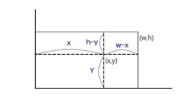

## <a href="https://www.acmicpc.net/problem/1085">백준 1085번 : 직사각형에서 탈출 (브론즈 3)</a>

### 풀이 1

- 풀이한 날짜 : 2022-03-09

<br/>

```python
x, y, w, h = tuple(map(int, input().split()))
dist = [x, y, (h - y), (w - x)]

min = 1000
for elem in dist:
  if elem < min:
    min = elem

print(min)
```

#### 풀이 로직

- 우선 조건을 통해 x, y의 위치가 직사각형 내부에 위치해있음을 알아야 한다.

- 점 (x, y)에서 직사각형 경계선으로 가는 방법은 상하좌우로 4가지가 있는데, 각각의 길이는 모두 x, y, w, h로 표현할 수 있다. (아래 사진 참고) 

    

- 각각의 길이 값을 리스트에 저장하고 가장 작은 값을 정렬을 통해 찾아주면 답을 얻을 수 있다.

<br/>

#### 문제 접근 과정 및 느낀점

- 처음엔 조건을 제대로 보지 않아 점의 위치가 직사각형 밖인 경우도 고려해야 하나 싶었다.

- 하지만 다시 조건을 꼼꼼히 살펴보면서 생각을 빠르게 수정할 수 있었다.

- 직사각형 내부에 점이 있는 경우만 따지면 된다는 것을 안 이후, 2가지 풀잇법이 떠올랐다.

    - 4가지 경로를 모두 조사하여 최솟값을 정렬 비교로 찾기

    - 직사각형을 닮음 모양이 되도록 4등분한다 가정할 때 생기는 경계선을 기준으로 4가지 case로 분류하기

- 그러나 후자의 풀이는 전자에 비해 더 복잡할 것 같고, 그런다고 코드나 논리가 더 나을 것 같지도 않아 보였다. 따라서 전자의 경우를 택했다.

<br/>

- 코드를 작성할 떄는 일부러 내장 함수를 쓰지 않고 정렬 과정을 직접 구현했다.

<br/>

* ✨ 조건을 꼼꼼히 따진 점, 가능한 풀이를 떠올리고 어떤 풀이가 더 나을지 빠르게 판단한 점 모두 Nice 했다. 👍

* 앞으로도 PS 시 이런 사고 방식대로 하면 될 것 같다.

<br/><br/>

### 풀이 2 (모범 답안 참고)

> <a href="https://ooyoung.tistory.com/102">답안 출처</a>

- 풀이한 날짜 : 2022-03-09

<br/>

```python
x, y, w, h = map(int, input().split())
print(min(x, y, w-x, h-y))
```

#### 풀이 로직

- 내 풀이와 동일하다. 다만 내장 함수를 이용해서 코드 길이를 더 줄였다.

<br/>

#### 느낀 점

- X